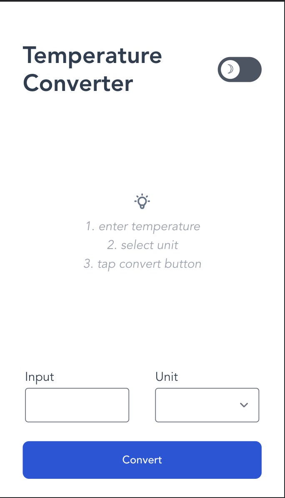

# Temperature Converter
A simple SPA temperature converter between celsius and farenheit.

## Demo
Please watch the demo video [here](xxxxxxxxxxxxxxxxxxxxxx).

## How to use
1. When the user opens the app, they are presented with a manual/hint screen with an temperature input and unit dropdown menu.
 

</img>

2. After entering the current temperature and selecting the current unit, the user can press the convert button and then the target temperature converted into the corresponding unit, rounded up to the 1st decimal, will display on the center of the screen.

 

</img>  
 

3. If the user changes the temperature input or the unit after a conversion the hint screen will come back to remind user to complete the steps. The same screen would show if the user is missing any of the above steps.

 

</img> 

 

4. The user is able to use the toggle button on the top right to turn on/off dark mode as needed.
 

</img> 

 

The web version is hosted [here](https://temperature-converter-brianlee9090.vercel.app/).

## How to install

    $ git clone https://github.com/brianlee9090/temperatureConverter.git
    $ npm install

## Tech/framework used
<b>Built with</b>
- [Vue](https://vuejs.org/)
- [Tailwind CSS](https://tailwindcss.com/)
Plugins:
- [Post CSS](https://postcss.org)
- [Autoprefixer](https://github.com/postcss/autoprefixer)
- [Flowbite](https://flowbite.com/)
- [Hero Icons](https://heroicons.com)

## Discussion on choice of framework and implementation
xxxxxxxxx
Please include the discussion for how you implemented the above requirement in the README file. As with the main solution, you should be able to explain the design and architectural decisions that led you to the final solution. 

When I received this assignment I wanted to create something that does the job, that is simple and elegant.
For the simplicity of the app and it being an SPA, I chose Vue over React for the quick creation with its CLI. I enjoyed using Tailwind which allowed me to change CSS in-line without going back and forth between template and style portions of my file. This also extends to the dark mode implementation. Tailwind allows me to change CSS of each individual element for dark mode with ease.
I could make everything onto one page, but felt like that would be too messy and long, so architecturally I decided to separate the unit dropdown and toggle button to child components. I could make the temperature input field and convert button child components too if I want App.vue to be even more concise.

## Contribute
If you have any suggestions to make this app better, feel free to fork the repo and create a pull request.
If you like this project, please give it a star! ⭐️

## License
MIT © [Brian Lee](https://github.com/brianlee9090)
